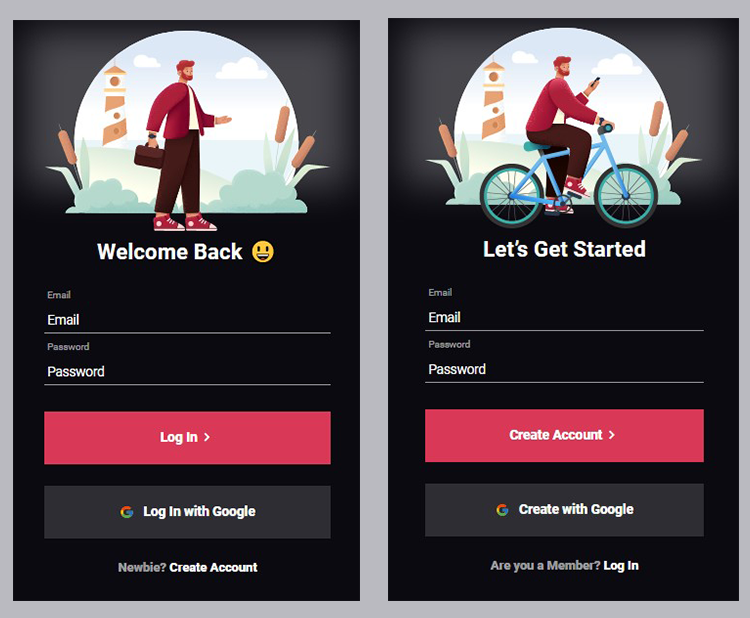

<h1 align="center"> Tela de Login/Criação de Conta para App </h1>

<h2>OBJETIVO</h2>

Criar uma tela de login para aplicativo, utilizando apenas html e css. Além da tela de login, criei a tela de criação de conta, podendo alternar entre elas na parte inferior da tela.

<h2> RESULTADO</h2>

<h2>ACESSE</h2>

<h2>FERRAMENTAS</h2>

<ul>
  <li>HTML</li>

  <li>CSS</li>

</ul>
